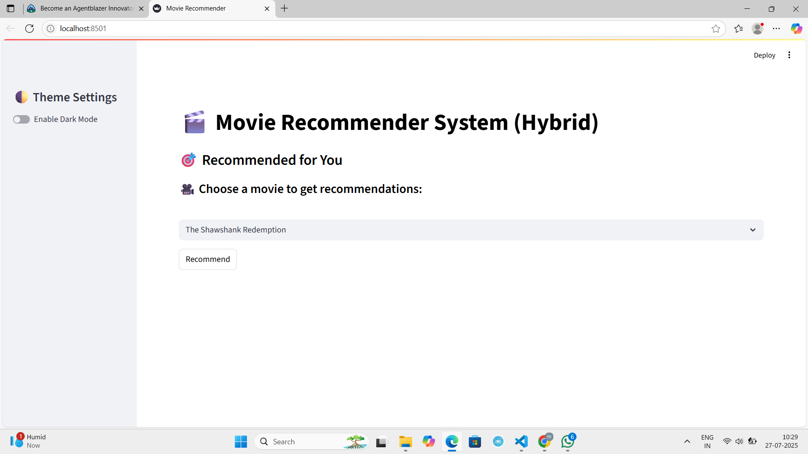
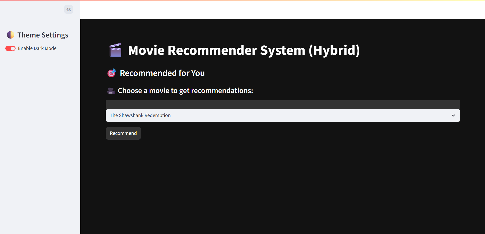
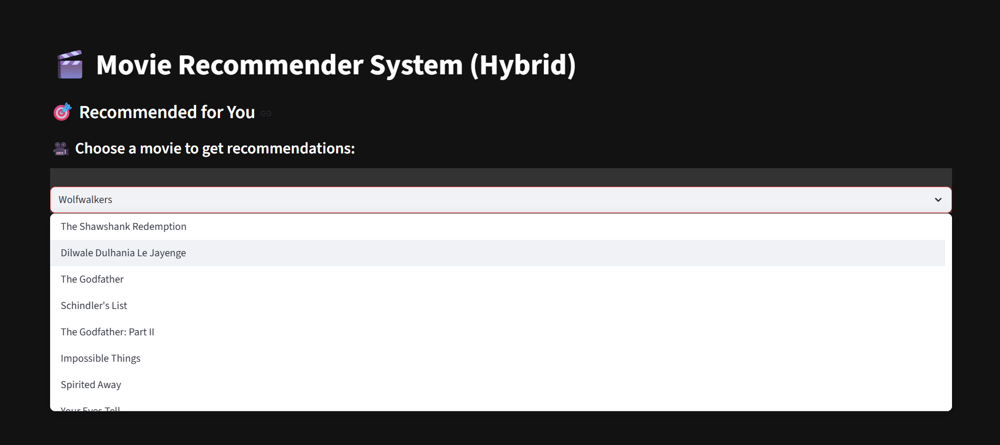
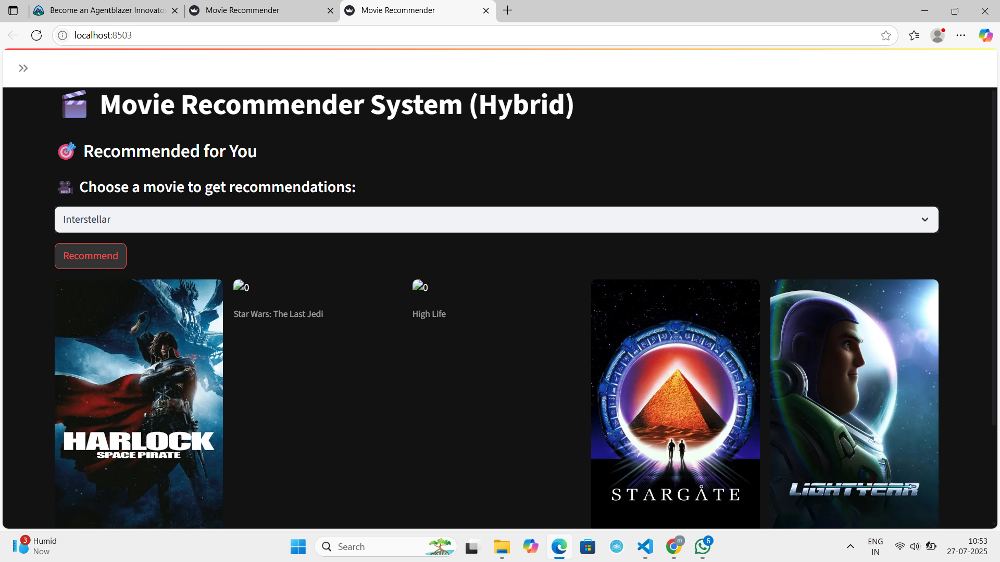
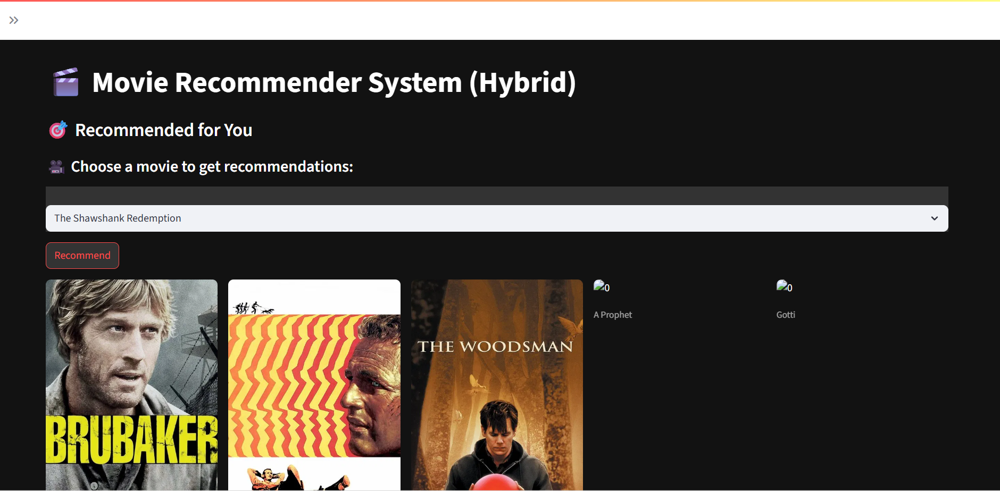
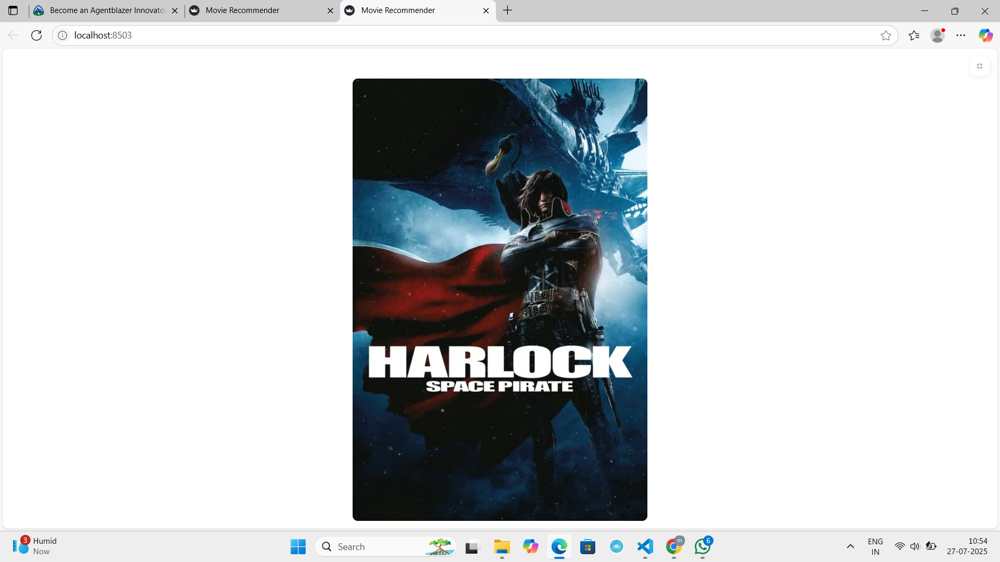
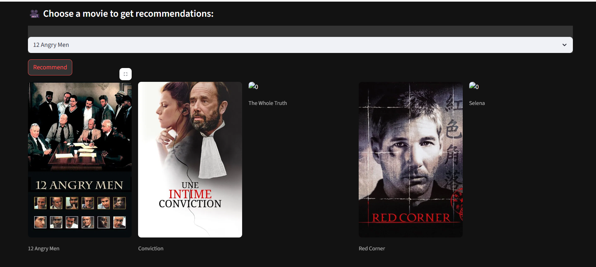

# MOVIE_RECOMMENDER_SYSTEM
# 🎬 Movie Recommender System (Hybrid)

This project is a **Hybrid Movie Recommendation System** built with **Streamlit** that leverages both **Collaborative Filtering** and **Content-Based Filtering** techniques. The system recommends top 5 similar movies based on user input and fetches movie posters via the **TMDB API**.

It also includes:
- 🔄 Hybrid recommendation engine (Collaborative + Content-Based)
- 🌗 Dark/Light theme toggle support
- 📷 TMDB poster integration for each recommended movie
- ⚡ Fast and interactive UI built with Streamlit
- 📊 Includes a Jupyter notebook for preprocessing and training
- 💾 Uses lightweight `.pkl` files for efficient inference

## 🧠 How It Works

1. **Input Movie**: User selects a movie title.
2. **Collaborative Filtering**: Computes similarity based on user preferences (`similarity.pkl`).
3. **Content-Based Filtering**: Computes similarity from metadata like genre, keywords (`content_similarity.pkl`).
4. **Hybrid Score**: Combines both using a weighted approach.
5. **TMDB API**: Fetches high-quality posters.
6. **Recommendations**: Displays top 5 movies with posters.


## 🛠️ Tech Stack

| Tool/Library     | Purpose |
|------------------|---------|
| **Python**       | Core programming language |
| **Streamlit**    | Web app development |
| **Pandas**       | Data processing and manipulation |
| **Scikit-learn** | Machine learning (for similarity matrices) |
| **Pickle**       | For loading saved model and data files |
| **TMDB API**     | Fetching posters |
| **HTML/CSS (via Streamlit)** | Basic UI rendering |

## 📊 Dataset

This system uses the publicly available dataset:  
**🔗 [Top Rated TMDB Movies (10K) – Kaggle](https://www.kaggle.com/datasets/ahsanaseer/top-rated-tmdb-movies-10k)**

### 📁 Dataset Highlights:

- 🎬 Over 10,000 top-rated movies from TMDB
- 🏷️ Fields include `title`, `overview`, `genres`, `popularity`, `vote_average`, etc.
- ✅ Used to build the **content-based filtering engine**

### 🧠 How It's Used:

- `genres`, `overview`, and `keywords` are processed via `CountVectorizer`
- A **content similarity matrix** is computed with cosine similarity
- The hybrid engine uses both this matrix and collaborative user similarity scores

## 📓 Jupyter Notebook (`main.ipynb`) and (`Hybrid.ipynb`)

The notebook includes:

- 🔍 Data loading and cleaning
- 🧠 Feature engineering (genres, keywords, overview)
- 🔢 Vectorization using `CountVectorizer`
- 📐 Cosine similarity calculation
- 💾 Saving processed data using `pickle` for reuse in the app
- 
## 💾 `.pkl` Files Explained

| File | Description |
|------|-------------|
| `movies_list.pkl` | DataFrame with movie IDs, titles, and metadata used for the dropdown and TMDB API |
| `similarity.pkl` | Collaborative similarity matrix (based on user ratings or item interactions) |
| `content_similarity.pkl` | Content-based similarity matrix from metadata like genres and overview |

## 🖼️ Screenshots

| Light Mode | Dark Mode |
|------------|-----------|
|  |  |
|  |  |
|  |  |
|  |

## 🔑 TMDB API Key Setup

1. Go to [https://www.themoviedb.org](https://www.themoviedb.org).
2. Create an account and navigate to **Settings → API**.
3. Generate your **API key (v3 auth)**.
4. Replace the API key in your `app.py`:

```python
response = requests.get(
    f'https://api.themoviedb.org/3/movie/{movie_id}?api_key=YOUR_API_KEY')

## RUN Through the command
streamlit run app.py

